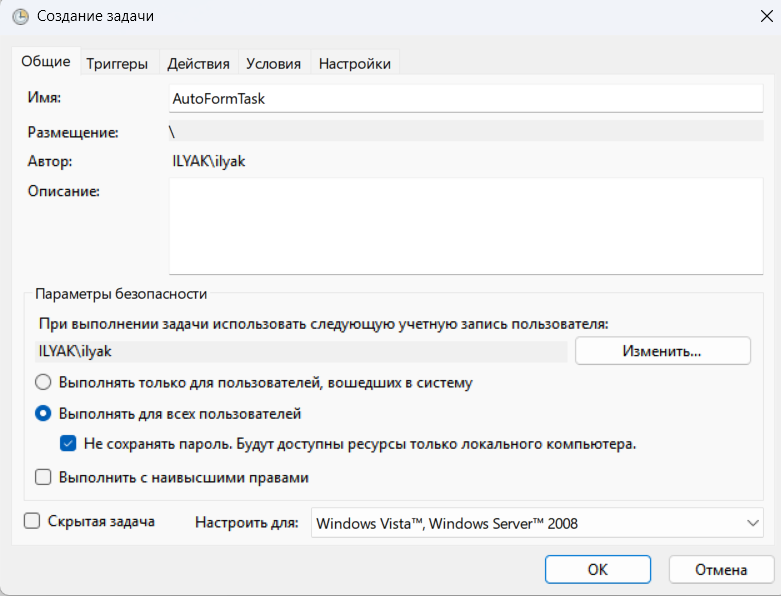
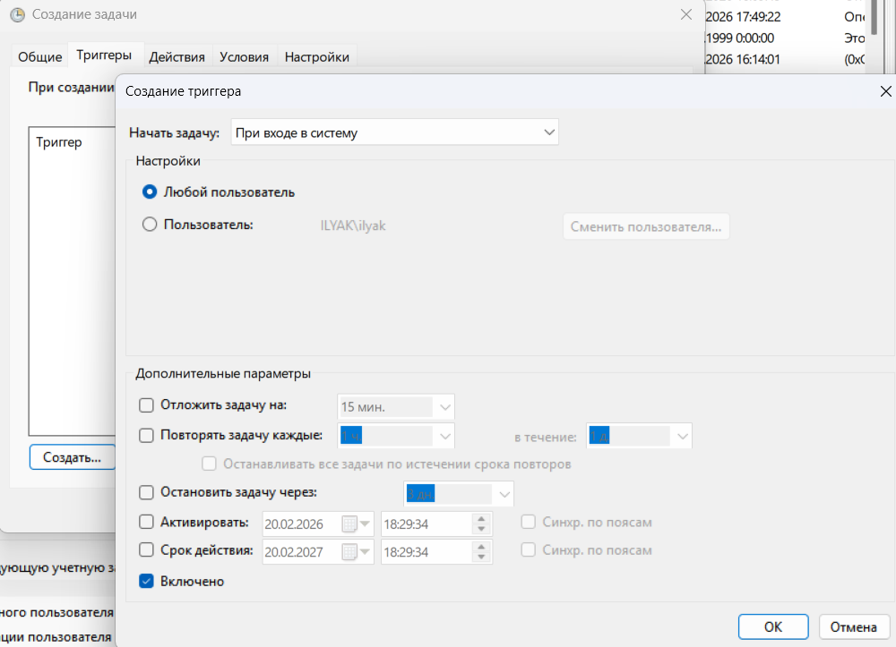
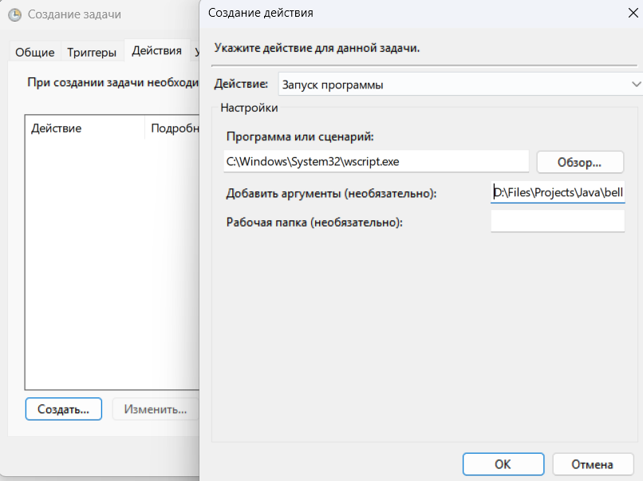
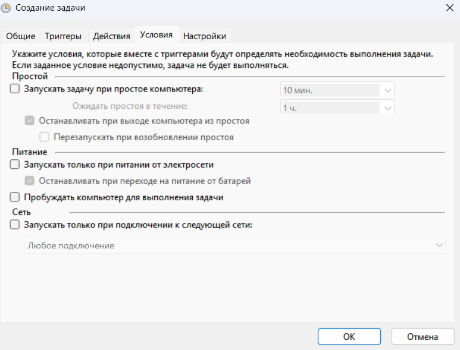
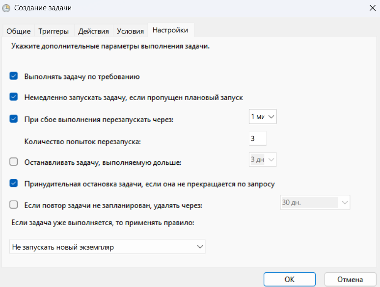

## Введение
Данный репозиторий содержит код проекта Auto-form, целью которого является автоматизация процесса
переноса ответов из Яндекс.Форм в Яндекс.Таблицу.
Яндекс.Форма имеет следующие поля (* - обязательное поле):

| Название         | Тип                               | Идентификатор вопроса |
|------------------|-----------------------------------|-----------------------|
| ФИО*             | Короткий текст                    | fio                   |
| Возраст*         | Целое число                       | age                   |
| Локация*         | Короткий текст                    | location              |
| Телеграм         | Короткий текст                    | telegram              |
| Почта(на Яндекс) | Короткий текст                    | mail                  |
| HR*              | Короткий текст                    | hr                    |
| Резюме*          | Файл(Максимальное количество - 1) | rezumes               |
| Опросник*        | Файл(Максимальное количество - 1) | questionnaires        |

## Особенности версии token-refresh-v1
В этой версии приложения запрос на обновление токена отправляется при запуске приложения, а также каждые 10 дней.

## Глоссарий
* 1 аккаунт Яндекс - аккаунт Яндекса, где расположена Яндекс.Форма и промежуточная Яндекс.Таблица. Кроме того, должен быть бизнес аккаунтом для доступа к API Яндекс.Форм;
* 2 аккаунт Яндекс - аккаунт Яндекса, где расположена результирующая Яндекс.Таблица;
* tokenStorage.csv - файл, в котором хранится токен, по умолчанию расположен в /home/$USER/data/.

## Endpoint
* /auth/start - при первом запуске приложения, а также, когда файл tokenStorage.csv пуст, или 
содержит токен с истекшим сроком жизни, необходимо перейти по этому endpoint'у, и дать доступ
приложению к 1 аккаунту Яндекса.

## Системные требования
* Maven;
* Java 17;
* Google Chrome;
* Chrome Driver.

## Команды для установки Google Chrome и Chrome Driver (Ubuntu 24.04.3 LTS)
На данный момент стабильные версии Google Chrome - 145.0.7632.46, Chrome Driver - 145.0.7632.46 (https://googlechromelabs.github.io/chrome-for-testing/). Версии Google Chrome и Chrome Driver должны быть соответствующие.

```bash
cd /tmp
curl -O "https://storage.googleapis.com/chrome-for-testing-public/145.0.7632.46/linux64/chrome-linux64.zip"
unzip chrome-linux64.zip
sudo mv /tmp/chrome-linux64 /usr/local/bin
sudo ln -s /usr/local/bin/chrome-linux64/chrome /usr/local/bin/google-chrome
sudo apt-get update && sudo apt-get install -y \
    libatk1.0-0t64 \
    libatk-bridge2.0-0t64 \
    libgtk-3-0t64 \
    libgdk-pixbuf2.0-0 \
    libasound2t64 \
    libnss3 \
    libxss1 \
    libfontconfig1 \
    libdbus-1-3
sudo apt-get install libgbm1
```

```bash
cd /tmp
curl -O "https://storage.googleapis.com/chrome-for-testing-public/145.0.7632.46/linux64/chromedriver-linux64.zip"
unzip chromedriver-linux64.zip
sudo mv /tmp/chromedriver-linux64/chromedriver /usr/local/bin/
```

## Регистрация приложения Яндекс для получения доступа к Яндекс.API по протоколу OAuth
Инструкция по регистрации Яндекс приложения: https://yandex.ru/dev/id/doc/ru/register-auth

На шаге 2 инструкции необходимо выбрать "Веб-сервисы", а также указать Redirect URI сервера, где запушен auto-form 
с endpoint'ом /auth/back (например, http://localhost:8080/auth/back).

На шаге 3 инструкции дать следующие доступы:
* forms:read;
* cloud_api:disk.read;
* cloud_api:disk.write.

## Создание бизнес-аккаунта Яндекс

Для получения доступа к API Яндекс.Форм необходимо иметь бизнес аккаунт.

Для его создания необходимо перейти по ссылке https://console.yandex.cloud и создать организацию для 1 аккаунта Яндекс.

Далее перейти по ссылке https://forms.yandex.ru/admin/ и в разделе бизнес форм создать новую бизнес форму. 

## Настройка Яндекс Почты

Для настройки отправки по SMTP протоколу необходимо воспользоваться следующей инструкцией: https://yandex.ru/support/yandex-360/customers/mail/ru/mail-clients/others#smtpsetting

## Свойства приложения
| Свойство                          | Переменные среды                  | Значение                                                                                                                                                                                      | По умолчанию                      |
|-----------------------------------|-----------------------------------|-----------------------------------------------------------------------------------------------------------------------------------------------------------------------------------------------|-----------------------------------|
| yandex.client_id                  | YANDEX_CLIENT_ID                  | идентификатор пользователя Яндекс приложения                                                                                                                                                  |                                   |
| yandex.secret_client_id           | YANDEX_SECRET_CLIENT_ID           | секретный ключ пользователя Яндекс приложения                                                                                                                                                 |                                   |
| yandex.redirect_uri               | YANDEX_REDIRECT_URI               | redirect uri, который был указан при регистрации приложения Яндекс                                                                                                                            | http://localhost:8080/auth/back   |
| yandex.survey_id                  | YANDEX_SURVEY_ID                  | идентификатор Яндекс.Формы                                                                                                                                                                    |                                   |
| yandex.files_directory            | YANDEX_FILES_DIRECTORY            | путь до директории на Яндекс.Диске на 1 аккаунте Яндекса, где будут хранится файлы (резюме и опросник) из ответов к Яндекс.Форме, который должен быть записан относительно корня Яндекс.Диска | /foldir                           |
| yandex.csv_token_path             | CSV_TOKEN_PATH                    | абсолютный путь до файла tokenStorage.csv                                                                                                                                                     | /home/$USER/data/tokenStorage.csv |
| yandex-two.url_disk               | YANDEX_TWO_URL_DISK               | url адрес до Яндекс.Таблицы на 2 аккаунте Яндекса, ссылка должна быть доступна для редактирования не авторизированным пользователем                                                           |                                   |
| current.polling_time_milliseconds | CURRENT_POLLING_TIME_MILLISECONDS | период, с которым программа запускается в миллисекундах                                                                                                                                       | 43200000                          |
| spring.mail.protocol              | SPRING_MAIL_PROTOCOL              | Протокол для отправки почты                                                                                                                                                                   | smtps                             |
| spring.mail.host                  | SPRING_MAIL_HOST                  | Адрес SMTP-сервера                                                                                                                                                                            | smtp.yandex.ru                    |
| spring.mail.port                  | SPRING_MAIL_PORT                  | Порт для SMTP-соединения                                                                                                                                                                      | 465                               |
| spring.mail.username              | SPRING_MAIL_USERNAME              | Адрес электронной почты Яндекса, с которого будут отправляться письма                                                                                                                         |                                   |
| spring.mail.password              | SPRING_MAIL_PASSWORD              | Пароль приложения для Яндекс.Почты.                                                                                                                                                           |                                   |
| spring.mail.to                    | SPRING_MAIL_TO                    | Адрес электронной почты куда будут отсылаться письма                                                                                                                                          |                                   |

## Запуск приложения
Linux (Ubuntu):
1. Установить свойства в application.properties или соответствующие переменные среды(можно пропустить шаг 1 выполнив шаг 3.2).
2. Собрать проект: `mvn clean package -DskipTests`
3. Запустить приложение одним из следующих способов:

3.1.
```bash
java -jar target/auto-form-0.0.1.jar
```
3.2.
```bash
java -jar target/auto-form-0.0.1.jar \
    --yandex.client_id="..." \
    --yandex.secret_client_id="..." \
    --yandex.redirect_uri="..." \
    --yandex.survey_id="..." \
    --yandex-two.url_disk="..."
```


Если файл tokenStorage.csv пустой, перейти по endpoint /auth/start и предоставить приложению доступ к данным 1 аккаунта Яндекс.**

## Создание задачи в планировщике задач
1. Создать файл start.bat, например, в директории с проектом. И вставить в него следующие команды (заменить {...}):

```
cd {путь до директории проекта}
java -jar {путь до jar-файла} > {путь до файла log.txt} 2>&1
```

2. Создать файл start.vbs, например, в директории с проектом. И вставить в него следующие команды (заменить {...}):

```
Set WshShell = CreateObject("WScript.Shell")
WshShell.Run chr(34) & "{путь до файла start.bat}" & Chr(34), 0
Set WshShell = Nothing
```

3. Открыть планировщик задач (Win+R -> taskschd.msc).

3.1. В левой панели выбрать "Библиотека планировщика задач".
В правой панели выбрать "Создать задачу":



3.2. Перейти в раздел "Триггеры" и нажать кнопку "Создать...":



3.3. Перейти в раздел "Действия" и нажать кнопку "Создать...". В пункте "Программа или сценарий" вставить C:\Windows\System32\wscript.exe. В пункте добавить аргументы указать путь до файла start.vbs:



3.4. Перейти в раздел "Условия" и выбрать нужные условия:



3.5. Перейти в раздел "Настройки" и указать необходимые параметры:



3.6. Нажать "ОК".


